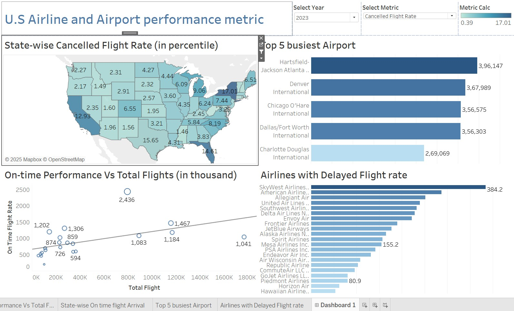

# Airline-Data-Warehouse
Data warehouse project for U.S. airline performance analysis using SSIS, SSRS, and Tableau.
# Airline Performance Data Warehouse & Analytics

A **data warehouse** solution to analyze U.S. domestic airline delays, cancellations, and operational efficiency using SQL Server, SSIS, SSRS, Tableau, and Neo4j.

## 🛠️ Technologies
- **Data Warehousing**: SQL Server, SSIS (ETL), Star Schema Design  
- **Visualization**: Tableau, SSRS  
- **Databases**: SQL Server (Relational), Neo4j (Graph)  
- **Languages**: SQL, Cypher (Neo4j), DAX (for Tableau)

## 📂 Project Structure
- **ETL Pipeline**: SSIS workflows to clean and load data into a dimensional model.
- **Reports**: 4 SSRS reports (e.g., seasonal delay trends, airport performance).
- **Dashboards**: 4 Tableau visualizations (e.g., state-wise cancellations).
- **Graph Database**: Neo4j implementation with 7 comparative SQL/Cypher queries.

## 🚀 Key Features
- **Star Schema**: Optimized for BI reporting with `FactAirlineAnalysis` and dimensions (`DimAirport`, `DimDate`, etc.).
- **Automated ETL**: SSIS packages handle data extraction, transformation (e.g., calculating delay rates), and loading.
- **Insights**: Identified top cancellation states, busiest airports, and seasonal delay patterns.

## 📊 Sample Output
|  |  |
|---------------------------------------------------------------------------|-----------------------------------------------------------------------------|
| *SSRS Report: On-Time Performance*                                        | *Tableau Dashboard: State-wise Cancellations*                               |
## 🏆 Key Achievements  
- Reduced data processing time by 30% through optimized SSIS workflows  
- Identified top 3 delay-prone airports using Tableau, enabling operational improvements  
- Implemented star schema reducing query time by 40% for BI reports

## 🔍 How to Use
1. **Data Warehouse Setup**:
   - Run scripts in `Data_Warehouse/SQL_Scripts/` to create tables.
   - Import SSIS package (`Airlines_SSIS.dtsx`) to execute ETL.
2. **Neo4j Comparison**:
   - Load Chinook DB data using scripts in `Graph_Database/Neo4J_Scripts/`.

## 📜 License
Open-source (MIT). Data samples are synthetic.
